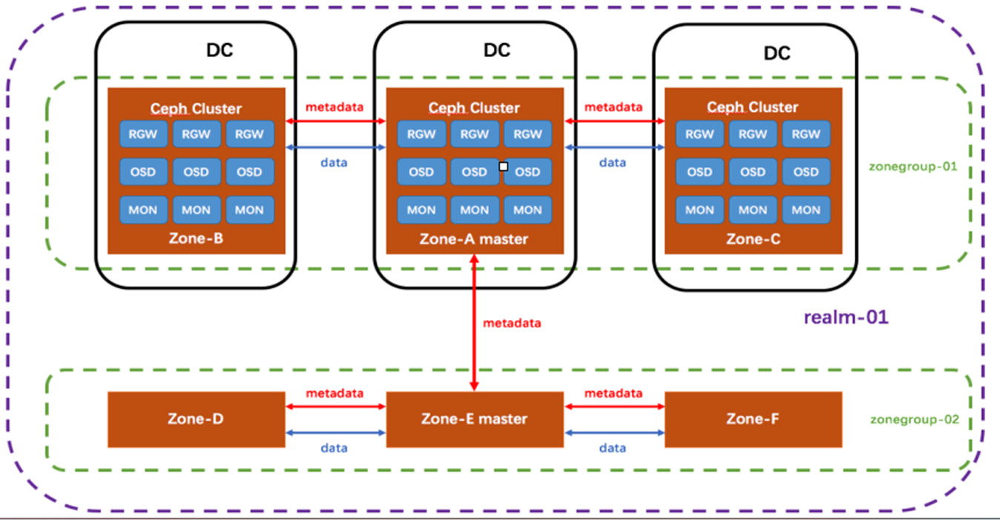
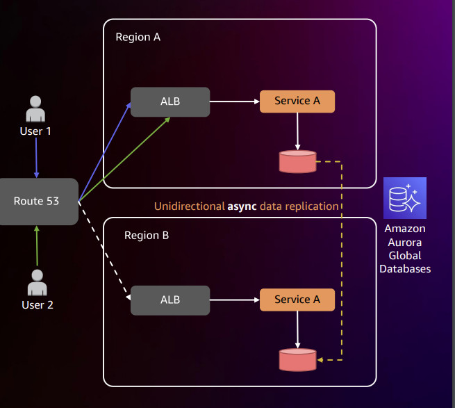
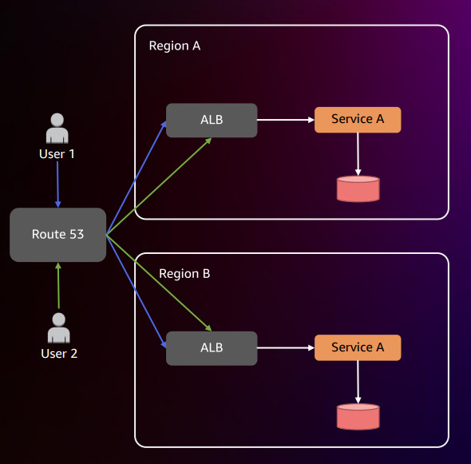
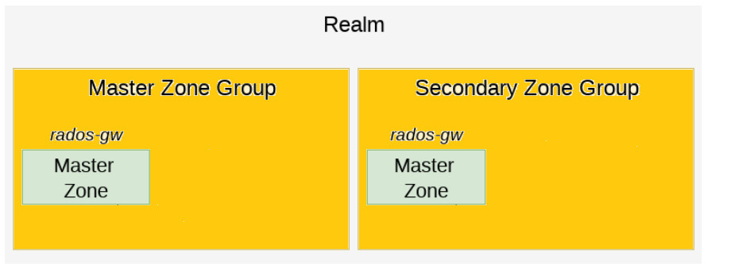

## 1, Kiến trúc Multi-site

- Zone: Mỗi zone là một cụm Ceph storage. Mỗi zone khác nhau có thể chạy nhiều phiên bản Ceph khác nhau (theo Ceph mỗi zone chạy được một hoặc nhiều phiên bản ceph-radosgw khác nhau).

- Zonegroup: Chứa nhiều zone. Mỗi Reaml chứa một master zonegroup. 

- Realm: RGW Ceph hỗ trợ khái niệm về Realm, có thể là một zonegroup hoặc nhiều zonegroup và một không gian tên toàn cầu duy nhất cho Realm.

<div align="center">



</div>

### 1.1 Quá trình đồng bộ hóa

- Quá trình đồng bộ hóa bao gồm hai loại thay đổi chính: thay đổi metadata và thay đổi data. Thay đổi metadata là các thay đổi với bucket như tạo mới, xóa cho bucket và thay đổi thông tin người dùng. Thay đổi data là các thay đổi với object như cập nhật, chỉnh sửa hoặc xóa dữ liệu trong hệ thống lưu trữ.

**Đồng bộ hóa metadata:**
- Các thay đổi metadata được sao chép đồng bộ trên toàn hệ thống.
- Mỗi realm  có một master metadata duy nhất, nằm trong master zonegroup.
- Chỉ master metadata mới thực hiện các thay đổi metadata. Có một nhật ký riêng cho các thay đổi metadata, cho phép theo dõi chi tiết các thay đổi này.
- Mỗi cụm Ceph (Ceph cluster) đều có một bản sao lưu cục bộ của nhật ký metadata, giữ thông tin về các thay đổi metadata đã xảy ra. Nhật kí này  sẽ được lưu ở pool (master-zone).rgw.log.
- Nếu master metadata bị tắt, người dùng sẽ không thể thực hiện các cập nhật metadata cho đến khi được chỉ định một master metadata mới.
- Khi master metadata  trong hệ thống Ceph bị tắt hoặc gặp sự cố, quá trình thăng cấp một master metadata standby thành master mới cần được thực hiện để đảm bảo tính sẵn sàng và khả năng cập nhật metadata trong hệ thống.

- Ceph có khả năng tự động chọn và thăng cấp một master metadata standby thành master mới bằng cách sử dụng các cấu hình và thuật toán quy định. Ceph sử dụng một thuật toán bầu chọn (election algorithm) dựa trên quorum để xác định master metadata standby phù hợp để thăng cấp. Các master metadata standby cùng tham gia quá trình bầu chọn để xác định ai sẽ trở thành master mới.

**Đồng bộ hóa data:**
- Mặc định, đồng bộ (Active/Active sync) cho phép cả đọc và ghi dữ liệu đồng thời trên nhiều zone. Người dùng có khả năng cấu hình một zone chỉ để chế độ chỉ đọc (Active/Passive), nghĩa là dữ liệu chỉ được đọc trên zone này, và khi cần thì mới được cập nhật.
- Khi sử dụng Active/Active khả năng xảy ra không nhất quán dữ liệu giữa hai zone khi ghi cùng một dữ liệu. Điều này có thể gây ra lỗi dữ liệu hoặc trạng thái không chính xác. Ghi đồng thời vào cả hai zone có thể làm giảm hiệu suất hệ thống do tăng cường xung đột và đồng bộ dữ liệu. Có thể xử lý bằng cách cấu hình sử dụng thời gian ghi hoặc áp dụng quy tắc ưu tiên để xác định phiên bản dữ liệu đúng.

- Trước tiên, thực hiện đồng bộ hoàn toàn để đảm bảo dữ liệu được đồng bộ đầy đủ. Sau đó, tiếp tục đồng bộ theo cách gia tăng để chỉ đồng bộ những thay đổi mới. Quá trình đồng bộ đầy đủ yêu cầu đọc, ghi và xử lý lượng lớn dữ liệu. Điều này tạo tải lượng I/O lớn trên hệ thống, có thể làm giảm tốc độ đọc/ghi và thời gian phản hồi của hệ thống. Tuy nhiên, sau khi quá trình đồng bộ đầy đủ ban đầu hoàn thành và hệ thống đã đồng bộ toàn bộ dữ liệu, việc đồng bộ theo cách gia tăng (incremental synchronization) sẽ giữ tải lượng mạng, tải lượng I/O và tài nguyên hệ thống ở mức thấp hơn. Việc này nhằm đồng bộ chỉ những thay đổi mới, giảm sự ảnh hưởng lên hiệu suất so với quá trình đồng bộ đầy đủ.

- Mỗi bucket trong mỗi zone có một số phiên bản duy nhất được tăng lên mỗi khi có thay đổi, giúp theo dõi các thay đổi trên bucket đó một cách độc lập.

## **2, Các mô hình thiết kế của AWS**:

### 2.1 Mô hình actice/passive

<div align="center">



</div>

**Use case:**

- Mô hình hoạt động/chỉ đọc (Active/Passive) được sử dụng để chuẩn bị cho các tình huống xảy ra sự cố hoặc để duy trì tính sẵn sàng hoạt động trong trường hợp khẩn cấp.

- Một số yêu cầu theo quy định hoặc quy tắc an ninh đôi khi yêu cầu một vùng chỉ đọc (Passive) để đảm bảo tính bảo mật và ngăn chặn các thay đổi không ủy quyền. 


### 2.2 Mô hình actice/active

<div align="center">



</div>

**Use case**

- Mô hình Active/Active được sử dụng để đảm bảo tính sẵn có cực cao bằng cách cho phép cả hai hệ thống (hoặc nhiều hệ thống) hoạt động đồng thời và xử lý tải khác nhau. Khi một hệ thống gặp sự cố, các yếu tố khác vẫn tiếp tục hoạt động một cách bình thường, giữ cho dịch vụ luôn sẵn sàng và tránh gián đoạn lớn.

- Mô hình Active/Active cho phép tối ưu hiệu suất hệ thống bằng cách phân tải tải công việc giữa các hệ thống đồng thời. Điều này đặc biệt quan trọng đối với các ứng dụng đòi hỏi độ trễ thấp (low latency) và cần xử lý các yêu cầu một cách nhanh chóng.

- Mô hình Active/Active giúp giảm thiểu thời gian phục hồi (RTO) và thời gian mất dữ liệu (RPO) khi xảy ra sự cố. Với khả năng xử lý song song và chia tải, hệ thống có thể khôi phục và tiếp tục hoạt động một cách nhanh chóng và ít mất dữ liệu. Điều này đảm bảo rằng thời gian gián đoạn và mất dữ liệu sau khi xảy ra sự cố được giữ ở mức tối thiểu.

## 3 Demo multi-zone trong ceph.

### 3.1 Lab 1 zonegroup có 2 zone.
Sử dụng 2 cụm Ceph làm 2 zone:
```yaml
[root@cluster1] ~# ceph -s
  cluster:
    id:     d6e42188-9871-471b-9db0-957f47893902
    health: HEALTH_OK

  services:
    mon: 1 daemons, quorum cluster1
    mgr: cluster1(active)
    osd: 3 osds: 3 up, 3 in
    rgw: 1 daemon active

  data:
    pools:   4 pools, 32 pgs
    objects: 187 objects, 1.09KiB
    usage:   3.01GiB used, 56.7GiB / 59.7GiB avail
    pgs:     32 active+clean

```

```yaml
[root@cluster2 ~]# ceph -s
  cluster:
    id:     2e80de18-e95f-463f-9eb0-531fd3254f0b
    health: HEALTH_OK

  services:
    mon: 1 daemons, quorum cluster2
    mgr: cluster2(active)
    osd: 3 osds: 3 up, 3 in
    rgw: 1 daemon active

  data:
    pools:   4 pools, 32 pgs
    objects: 187 objects, 1.09KiB
    usage:   3.01GiB used, 56.7GiB / 59.7GiB avail
    pgs:     32 active+clean

```

Tạo 1 reaml 

```yaml
[root@cluster1 ~]# radosgw-admin realm create --rgw-realm=realm100 --default
{
    "id": "337cd1c3-1ad0-4975-b220-e021a7f2b3eb",
    "name": "realm100",
    "current_period": "bd6ecbd6-3a28-46d7-a806-22e9ea001ca3",
    "epoch": 1
}
```

Tạo master-zonegroup:
```yaml
[root@cluster1 ~]# radosgw-admin zonegroup create --rgw-zonegroup=cn --endpoints=http://192.168.52.157:8080 --rgw-realm=realm100 --master --default
    {
        "id": "2b3f1ea0-73e7-4f17-b4f9-1acf5d5c6033",
        "name": "cn",
        "api_name": "cn",
        "is_master": "true",
        "endpoints": [S
            "http://192.168.52.157:8080"
        ],
        "hostnames": [],
        "hostnames_s3website": [],
        "master_zone": "",
        "zones": [],
        "placement_targets": [],
        "default_placement": "",
        "realm_id": "ba638e8a-8a33-4607-8fe3-13aa69dd1758"
    }
```

Tạo master-zone trong zonegroup:

```yaml
[root@cluster1 ~]# radosgw-admin zone create --rgw-zonegroup=cn --rgw-zone=DC1 --master --default --endpoints=http://192.168.52.157:8080
    {
        "id": "9c655173-6346-47e7-9759-5e5d32aa017d",
        "name": "DC1",
        "domain_root": "DC1.rgw.meta:root",
        "control_pool": "DC1.rgw.control",
        "gc_pool": "DC1.rgw.log:gc",
        "lc_pool": "DC1.rgw.log:lc",
        "log_pool": "DC1.rgw.log",
        "intent_log_pool": "DC1.rgw.log:intent",
        "usage_log_pool": "DC1.rgw.log:usage",
        "reshard_pool": "DC1.rgw.log:reshard",
        "user_keys_pool": "DC1.rgw.meta:users.keys",
        "user_email_pool": "DC1.rgw.meta:users.email",
        "user_swift_pool": "DC1.rgw.meta:users.swift",
        "user_uid_pool": "DC1.rgw.meta:users.uid",
        "system_key": {
            "access_key": "",
            "secret_key": ""
        },
        "placement_pools": [
            {
                "key": "default-placement",
                "val": {
                    "index_pool": "DC1.rgw.buckets.index",
                    "data_pool": "DC1.rgw.buckets.data",
                    "data_extra_pool": "DC1.rgw.buckets.non-ec",
                    "index_type": 0,
                    "compression": ""
                }
            }
        ],
        "metadata_heap": "",
        "tier_config": [],
        "realm_id": "ba638e8a-8a33-4607-8fe3-13aa69dd1758"
    }
```

Tạo user system

```yaml
[root@cluster1 ~]# radosgw-admin user create --uid="syncuser" --display-name="Synchronization User" --system
    {
        "user_id": "syncuser",
        "display_name": "Synchronization User",
        "email": "",
        "suspended": 0,
        "max_buckets": 1000,
        "auid": 0,
        "subusers": [],
        "keys": [
            {
                "user": "syncuser",
                "access_key": "LPTHGKYO5ULI48Q88AWF",
                "secret_key": "jGFoORTVt72frRYsmcnPOpGXnz652Dl3C2IeBLN8"
            }
        ],
        "swift_keys": [],
        "caps": [],
        "op_mask": "read, write, delete",
        "system": "true",
        "default_placement": "",
        "placement_tags": [],
        "bucket_quota": {
            "enabled": false,
            "check_on_raw": false,
            "max_size": -1,
            "max_size_kb": 0,
            "max_objects": -1
        },
        "user_quota": {
            "enabled": false,
            "check_on_raw": false,
            "max_size": -1,
            "max_size_kb": 0,
            "max_objects": -1
        },
        "temp_url_keys": [],
        "type": "rgw"
    }

```

Cấu hình secondary zone:

```yaml
[root@cluster2 ~]# radosgw-admin period pull --url=http://192.168.52.157:8080 --access-key=LPTHGKYO5ULI48Q88AWF --secret=jGFoORTVt72frRYsmcnPOpGXnz652Dl3C2IeBLN8
    {
        "id": "064c5b5e-eb87-462c-aa37-c420ddd68b23",
        "epoch": 2,
        "predecessor_uuid": "1abfe2d0-7453-4c01-881b-3db7f53f15c1",
        "sync_status": [],
        "period_map": {
            "id": "064c5b5e-eb87-462c-aa37-c420ddd68b23",
            "zonegroups": [
                {
                    "id": "2b3f1ea0-73e7-4f17-b4f9-1acf5d5c6033",
                    "name": "cn",
                    "api_name": "cn",
                    "is_master": "true",
                    "endpoints": [
                        "http://192.168.52.157:8080"
                    ],
                    "hostnames": [],
                    "hostnames_s3website": [],
                    "master_zone": "9c655173-6346-47e7-9759-5e5d32aa017d",
                    "zones": [
                        {
                            "id": "9c655173-6346-47e7-9759-5e5d32aa017d",
                            "name": "DC1",
                            "endpoints": [
                                "http://192.168.52.157:8080"
                            ],
                            "log_meta": "false",
                            "log_data": "false",
                            "bucket_index_max_shards": 0,
                            "read_only": "false",
                            "tier_type": "",
                            "sync_from_all": "true",
                            "sync_from": []
                        }
                    ],
                    "placement_targets": [
                        {
                            "name": "default-placement",
                            "tags": []
                        }
                    ],
                    "default_placement": "default-placement",
                    "realm_id": "ba638e8a-8a33-4607-8fe3-13aa69dd1758"
                }
            ],
            "short_zone_ids": [
                {
                    "key": "9c655173-6346-47e7-9759-5e5d32aa017d",
                    "val": 1556250220
                }
            ]
        },
        "master_zonegroup": "2b3f1ea0-73e7-4f17-b4f9-1acf5d5c6033",
        "master_zone": "9c655173-6346-47e7-9759-5e5d32aa017d",
        "period_config": {
            "bucket_quota": {
                "enabled": false,
                "check_on_raw": false,
                "max_size": -1,
                "max_size_kb": 0,
                "max_objects": -1
            },
            "user_quota": {
                "enabled": false,
                "check_on_raw": false,
                "max_size": -1,
                "max_size_kb": 0,
                "max_objects": -1
            }
        },
        "realm_id": "ba638e8a-8a33-4607-8fe3-13aa69dd1758",
        "realm_name": "realm100",
        "realm_epoch": 2
    }
```

Tạo zone thứ 2 trong cùng zonegroup:

```yaml
[root@cluster2 ~]# radosgw-admin zone create --rgw-zonegroup=cn --rgw-zone=DC2 --endpoints=http://192.168.52.158:8080 --access-key=LPTHGKYO5ULI48Q88AWF --secret=jGFoORTVt72frRYsmcnPOpGXnz652Dl3C2IeBLN8
    {
        "id": "bf59d999-1561-4f7e-a874-9de718d4c31b",
        "name": "DC2",
        "domain_root": "DC2.rgw.meta:root",
        "control_pool": "DC2.rgw.control",
        "gc_pool": "DC2.rgw.log:gc",
        "lc_pool": "DC2.rgw.log:lc",
        "log_pool": "DC2.rgw.log",
        "intent_log_pool": "DC2.rgw.log:intent",
        "usage_log_pool": "DC2.rgw.log:usage",
        "reshard_pool": "DC2.rgw.log:reshard",
        "user_keys_pool": "DC2.rgw.meta:users.keys",
        "user_email_pool": "DC2.rgw.meta:users.email",
        "user_swift_pool": "DC2.rgw.meta:users.swift",
        "user_uid_pool": "DC2.rgw.meta:users.uid",
        "system_key": {
            "access_key": "LPTHGKYO5ULI48Q88AWF",
            "secret_key": "jGFoORTVt72frRYsmcnPOpGXnz652Dl3C2IeBLN8"
        },
        "placement_pools": [
            {
                "key": "default-placement",
                "val": {
                    "index_pool": "DC2.rgw.buckets.index",
                    "data_pool": "DC2.rgw.buckets.data",
                    "data_extra_pool": "DC2.rgw.buckets.non-ec",
                    "index_type": 0,
                    "compression": ""
                }
            }
        ],
        "metadata_heap": "",
        "tier_config": [],
        "realm_id": "ba638e8a-8a33-4607-8fe3-13aa69dd1758"
    }
```
Kiểm tra đồng bộ 2 zone

```yaml
[root@cluster2 ~]# radosgw-admin sync status
          realm ba638e8a-8a33-4607-8fe3-13aa69dd1758 (realm100)
      zonegroup 2b3f1ea0-73e7-4f17-b4f9-1acf5d5c6033 (cn)
           zone 0a2f706f-cc81-44f3-adf6-0d79c3e362ac (DC2)
  metadata sync syncing
                full sync: 0/64 shards
                incremental sync: 64/64 shards
                metadata is caught up with master
      data sync source: 9c655173-6346-47e7-9759-5e5d32aa017d (DC1)
                        syncing
                        full sync: 0/128 shards
                        incremental sync: 128/128 shards
                        data is caught up with source
```

Tạo bucket zone master DC1 và kiểm tra:

```yaml
[root@cluster1 ~]# s3cmd mb s3://bucket1
Bucket 's3://bucket1/' created
[root@cluster1 ~]# radosgw-admin bucket list
[
    "bucket1"
]
```

kiểm tra bucket tại zone 2:
```yaml
[root@cluster2 ~]# radosgw-admin bucket list
[
    "bucket1"
]
```
### 3.2 Lab 2 zonegroup mỗi zonegroup có 1 zone

<div align="center">



</div>

- Tạo reaml:
```yaml
[root@ceph01 ~]# radosgw-admin  realm create --rgw-realm=xzxj --default  
{
    "id": "0f13bb55-68f6-4489-99fb-d79ba8ca959a",
    "name": "xzxj",
    "current_period": "02a14536-a455-4063-a990-24acaf504099",
    "epoch": 1
}

``` 

- Tạo master zonegroup:
```yaml
[root@ceph01 ~]# radosgw-admin zonegroup create --rgw-zonegroup=hanoi --endpoints=http://192.168.52.157:8080 --rgw-realm=xzxj --master --default
```
- Tạo master zone:
```yaml
[root@ceph01 ~]# radosgw-admin  zone create --rgw-zonegroup=hanoi --rgw-zone=z1 --endpoints=http://192.168.52.157:8080 --default
```

- Tạo user system:
```yaml
[root@ceph01 ~]# radosgw-admin user create --uid="sync-user" --display-name="sync user" --system
{
    "user_id": "sync-user",
    "display_name": "sync user",
    "email": "",
    "suspended": 0,
    "max_buckets": 1000,
    "subusers": [],
    "keys": [
        {
            "user": "sync-user",
            "access_key": "ZA4TXA65C5TGCPX4B8V6",
            "secret_key": "BEYnz6QdAvTbt36L7FhwGF2F5rHWeH66cb0eSO24"
        }
    ],
```

- Khi các zone phụ cần hoàn tất xác thực với vùng chính, cần có access_key và secret_key của tài khoản hệ thống.
```yaml
[root@ceph01 ~]# radosgw-admin zone modify --rgw-zone=z1 --access-key=ZA4TXA65C5TGCPX4B8V6 --secret=BEYnz6QdAvTbt36L7FhwGF2F5rHWeH66cb0eSO24

[root@ceph01 ~]# radosgw-admin zonegroup modify --rgw-zonegroup= hanoi --access-key=ZA4TXA65C5TGCPX4B8V6 --secret=BEYnz6QdAvTbt36L7FhwGF2F5rHWeH66cb0eSO24

[root@ceph01 ~]# radosgw-admin period update --commit
```

- Thực hiện pull reaml về:
```yaml
[root@ceph02 ~]# radosgw-admin realm pull --url=http://192.168.52.157:8080 --access-key=ZA4TXA65C5TGCPX4B8V6 --secret=BEYnz6QdAvTbt36L7FhwGF2F5rHWeH66cb0eSO24
{
    "id": "0f13bb55-68f6-4489-99fb-d79ba8ca959a",
    "name": "xzxj",
    "current_period": "913e666c-57fb-4992-8839-53fe447d8427",
    "epoch": 2
}
```
Tạo zonegroup mới và masterzone:
```yaml
[root@ceph02 ~]# radosgw-admin zonegroup create --rgw-zonegroup=hcm --endpoints=http://192.168.52.158:8080 --rgw-realm=xzxj
```
- Tạo master zone:
```yaml
[root@ceph02 ~]# radosgw-admin  zone create --rgw-zonegroup=hcm --rgw-zone=z2 --endpoints=http://192.168.52.158:8080 

[root@ceph02 ~]# radosgw-admin period update --commit
```
Kiểm tra các zonegroup
```yaml
[root@ceph01 ~]# radosgw-admin zonegroup list
[
    "hanoi",
    "hcm"
]
```
Kiểm tra tính 2 zonegroup thì cùng một namespace:
```yaml
[root@ceph01 ~]# s3cmd mb s3://bucket1
Bucket 's3://bucket1/' created
[root@ceph01 ~]# radosgw-admin bucket list
[
    "bucket1"
]
```
```yaml
[root@ceph02 ~]# s3cmd mb s3://bucket1
ERROR: S3 error: 409 (BucketAlreadyExists): Bucket already exists under different user’s ownership.

```


